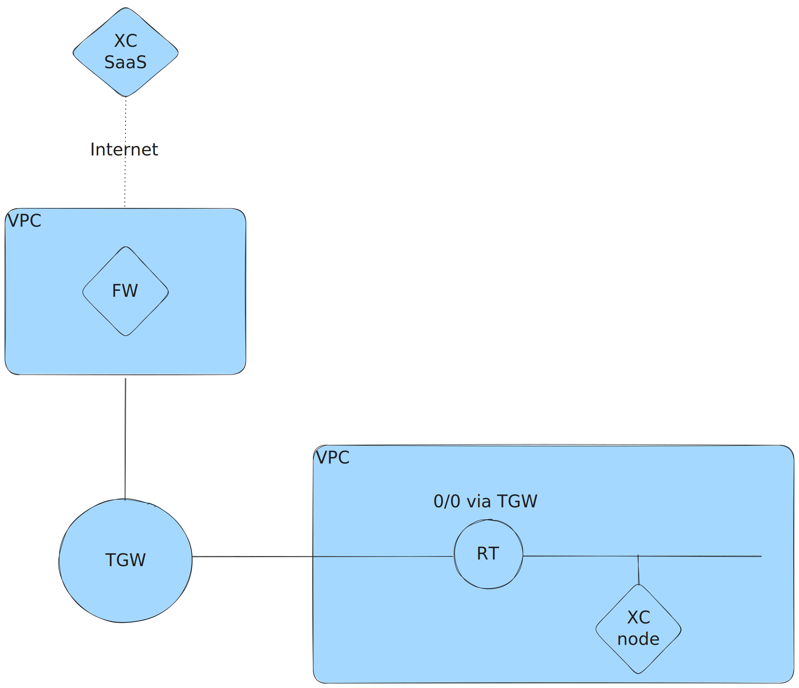
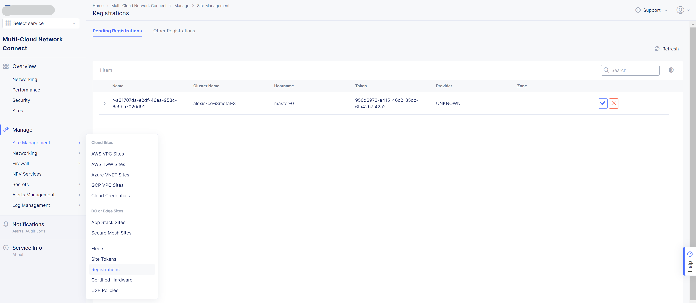
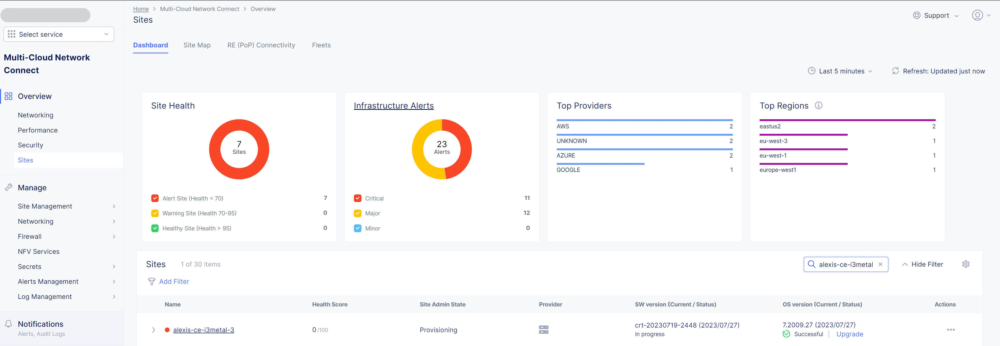
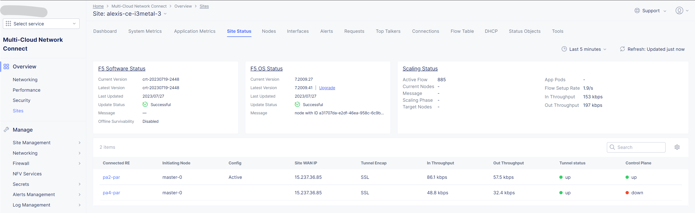
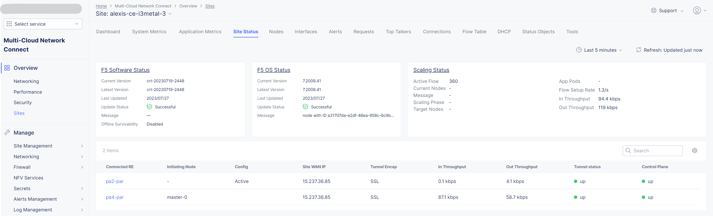

Install a F5 Distributed Cloud Customer Edge's Node using KVM on AWS
####################################################################
Some customer design requires to deploy a F5 Distributed Cloud (XC) Customer Edge (CE) in an internal network.
CE nodes has no Public IP address, no AWS Internet Gateway but Internet access is allowed through an egress gateway:
for example a FW or an egress Web Proxy hosted in an *egress VPC*.

The use case could be to have a CE for discovering API endpoints of published applications
but the CE must seat between an existing Reverse-Proxy and the API GW in the data path.

This guide described the solution the solution for AWS: **deploy CE nodes using KVM on a bare metal server on AWS**.

If the CE is allowed to have a Public IP Address or an Internet access through an Internet Gateway, NAT Gateway or a Virtual Private Gateway,
use the native CE deployment in XC Console `AWS Site <https://docs.cloud.f5.com/docs/how-to/site-management/create-aws-site>`_.

.. contents:: Contents
    :local:

Source
*****************************************
This guide is based on the `Create KVM Site <https://docs.cloud.f5.com/docs/how-to/site-management/create-kvm-libvirt-site>`_ technical documentation.

Prerequisites
*****************************************
AWS
=========================================
- **At least one interface**: A ``VPC`` with at least one ``Subnet``
- **Internet reachability**: The ``Routing Table`` attached to the ``Subnet`` has a default route via a ``Transit Gateway`` or an egress security service
- **Internet connectivity to XC Console**: The egress security service allows the HTTP(S) flows listed `here <https://docs.cloud.f5.com/docs/reference/network-cloud-ref>`_
- **Amazon EC2 Bare Metal Instance type i3.metal**: `i3.metal <https://aws.amazon.com/pt/ec2/instance-types/i3/>`_ allows `the operational system to be executed directly on the underlying hardware <https://aws.amazon.com/blogs/aws/new-amazon-ec2-bare-metal-instances-with-direct-access-to-hardware/>`_.
- **Storage**: 100 GB minimum

XC
=========================================
- **Tenant**: a POC or a Production tenant with an admin role in the *Multi-Cloud Network Connect* service (*System* namespace)
- **Site Token**: Follow the chapter `here <https://docs.cloud.f5.com/docs/how-to/site-management/create-kvm-libvirt-site#create-a-site-token>`_
- **EULA**: By proceeding with the installation, download and/or access and use, as applicable, of the Distributed Cloud Services software, and/or Distributed Cloud Services platform, you acknowledge that you have read, understand, and agree to be bound by this `agreement <https://www.volterra.io/terms>`_.

Deployment guide
*****************************************
1. Create an AWS i3.metal instance
=========================================
- *AMI*: ``Ubuntu, 20.04 LTS, amd64 focal image``
- *Instance type*: ``i3.metal``
- *Key pair name*: use your own ``key pair``
- *Network settings*:
    - *VPC*: select an existing ``VPC``
    - *Subnet*: select an existing ``Subnet``
    - *Auto-assign public IP*: Disable
    - *Firewall*: create or select an existing ``Security Group`` that allows at least *Internet connectivity to XC Console* (see Prerequisites)
    - *Storage*: ``100`` GiB ``gp2`` volume at least

2. Access to your AWS i3.metal instance
=========================================
- Connect to i3.metal instance using SSH

.. code-block:: bash

    ssh -i my-private-ssh-key.pem ubuntu@<IP-ADDRESS>

- Elevate your privilege:

.. code-block:: bash

    sudo su -
    cd /home/ubuntu/

Optionally, you can check for Virtualization Support, as described below, but an i3.metal instance type supports it.

- Install a package to check for Virtualization Support

.. code-block:: bash

    apt install cpu-checker

- Check for Virtualization Support

.. code-block:: bash

    kvm-ok

    INFO: /dev/kvm exists
    KVM acceleration can be used

3. Install Packages
=========================================

.. code-block:: bash

    apt update
    apt install qemu qemu-kvm libvirt-daemon-system libvirt-clients bridge-utils virt-manager

4. Configure HugePages
=========================================
- Set value for parameter ``GRUB_CMDLINE_LINUX``:

.. code-block:: bash

    vi /etc/default/grub

    (...)
    GRUB_CMDLINE_LINUX="default_hugepagesz=2M hugepagesz=2M hugepages=1200"

- Update the configuration to make HugePages effective.

.. code-block:: bash

    update-grub
    grub-mkconfig -o /boot/grub/grub.cfg

- In AWS console, change the ``Instance state`` to ``Reboot instance``
- Wait 5mn then connect again using SSH
- Check the HugePages configuration after the host reboot:

.. code-block:: bash

    cat /proc/meminfo | grep Huge

    AnonHugePages:         0 kB
    ShmemHugePages:        0 kB
    FileHugePages:         0 kB
    HugePages_Total:    1200
    HugePages_Free:     1200
    HugePages_Rsvd:        0
    HugePages_Surp:        0
    Hugepagesize:       2048 kB
    Hugetlb:         2457600 kB

5. Create a Virtual Network
=========================================

- Create the specification for a new ``virtual network``. In the underlay network conflicts, set the network address field with a different subnet.

.. code-block:: bash

    touch new_libvirt_network.xml
    vi new_libvirt_network.xml
    <network>
      <name>virtualnetwork1</name>
      <forward mode='nat'>
        <nat>
          <port start='1024' end='65535'/>
        </nat>
      </forward>
      <bridge name='bridge1' stp='on' delay='0'/>
      <ip address='192.168.122.1' netmask='255.255.255.0'>
        <dhcp>
          <range start='192.168.122.2' end='192.168.122.254'/>
        </dhcp>
      </ip>
    </network>

- Define the new ``virtual network``

.. code-block:: bash

    virsh net-define new_libvirt_network.xml

- Destroy the existing ``default`` virtual network

.. code-block:: bash

    virsh net-destroy default

- Start the virtual network and enable it for autostart.

.. code-block:: bash
    virsh net-start virtualnetwork1
    virsh net-autostart virtualnetwork1

- List the libvirt networks to verify that the virtual network was created.

.. code-block:: bash

    virsh net-list

     Name              State    Autostart   Persistent
    ----------------------------------------------------
     virtualnetwork1   active   yes         yes

- Optionally, list your bridge devices.

.. code-block:: bash

    brctl show

    bridge name     bridge id               STP enabled     interfaces
    bridge1         8000.525400e4f9db       yes             bridge1-nic

6. Install Node using Terminal
=========================================
- Copy the URI to the latest ISO file `here <https://docs.cloud.f5.com/docs/images/node-cert-hw-kvm-images>`_
- Download the latest ISO file using the copied URI

.. code-block:: bash

    wget https://downloads.volterra.io/dev/images/centos/7.2009.27-202211040823/vsb-ves-ce-certifiedhw-generic-production-centos-7.2009.27-202211040823.1667791030.iso

- Create a Virtual Disk Image (VDI) file

.. code-block:: bash

    emu-img create /var/lib/libvirt/images/volterra.qcow 45G

- Create a new virtual machine using the latest ISO file downloaded

.. code-block:: bash

    virt-install \
        --name Volterra \
        --memory 28000 \
        --vcpus=8 \
        --network network=virtualnetwork1,model=virtio \
        --accelerate \
        --disk path=/var/lib/libvirt/images/volterra.qcow,bus=virtio,cache=none,size=64 \
        --cdrom /home/ubuntu/vsb-ves-ce-certifiedhw-generic-production-centos-7.2009.27-202211040823.1667791030.iso \
        --noautoconsole \
        --noreboot

- Wait 5mn
- Start the virtual machine

.. code-block:: bash

    virsh start Volterra

- Verify the status of the virtual machine

.. code-block:: bash

    virsh list --all

     Id   Name       State
    --------------------------
     1    Volterra   running

- Optionally, connect the virtual machine using the Console access

.. code-block:: bash

    virsh console 1

    Connected to domain Volterra
    Escape character is ^]

    UNAUTHORIZED ACCESS TO THIS DEVICE IS PROHIBITED
    All actions performed on this device are audited
    master-0 login:

6. Configure Node
=========================================
- Connect to the virtual machine using SSH: username: **admin**, password: **Volterra123**

.. code-block:: bash

    virsh domifaddr Volterra
     Name       MAC address          Protocol     Address
    -------------------------------------------------------------------------------
     vnet0      52:54:00:51:ff:32    ipv4         192.168.122.161/24

    ssh admin@192.168.122.161

- Configure the ``Network`` options if you use an Explicit Web Proxy

.. code-block:: bash

    >>> configure-network

- Configure the main options:
    - ``Latitude`` and ``Longitude``: the GPS location of your AWS region
    - ``Token``: see chapter Prerequisites
    - ``site name``: choose your own name

.. code-block:: bash

    >>> configure
    ? What is your token? 950d6972-e415-46c2-85dc-6fa42b7f42a2
    ? What is your site name? [optional] ce-i3metal
    ? What is your hostname? [optional] master-0
    ? What is your latitude? [optional] 48.866667
    ? What is your longitude? [optional] 2.333333
    ? What is your default fleet name? [optional]
    ? Select certified hardware: kvm-voltmesh
    ? Select primary outside NIC: eth0
    ? Confirm configuration? Yes

7. Register the Site
=========================================
- Go to your F5 XC Console
- Navigate to the ``Registrations`` menu and accept the pending registration by click the blue checkmark

- A new windows opens. Do not change any value, just click on ``Save and Exit``.
- Wait 1 minute then check site status that should be in ``PROVISIONNING`` state

- Using the the SSH connection at step 6, follow the installation logs

.. code-block:: bash

    >>> log vpm

- Wait 15 minute then check site status that should be in ``ON LINE`` state
- Check detailed site Status, if IPsec is used for VPN tunnels or SSL. SSL is used if IPsec port are not allowed on your FW or if your are using a Transparent Proxy.

- Click on ``Upgrade`` if the installed OS is not the latest
- Your SSH connection will be closed during upgrade. Connect gain in order to check installation logs.

.. code-block:: bash

    >>> log vpm

- Wait 15mn, you should have the status ``UP`` for Control Plane and Data Plane

- Troubleshooting tips: restart the VM if the status is ``DOWN``, then check vpm logs

.. code-block:: bash

    virsh shutdown Volterra
    virsh list --all
    virsh start Volterra
    virsh console X