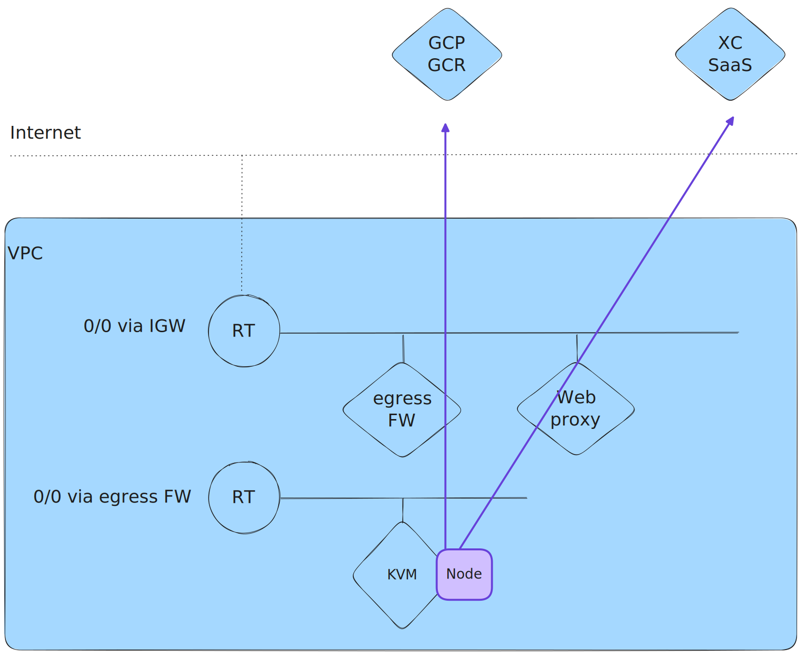

Install a F5 XC CE Node using KVM on AWS
####################################################################
Some customer design requires to deploy a F5 Distributed Cloud (XC) Customer Edge (CE) in an internal network.
CE nodes has no Public IP address, no AWS Internet Gateway but Internet access is allowed through an egress gateway:
for example a FW or an egress Web Proxy hosted in an *egress VPC*.

The use case could be to have a CE for discovering API endpoints of published applications
but the CE must seat between an existing Reverse-Proxy and the API GW in the data path.

Egress doors (FW and explicit web proxy) can be in a different *egress* VPC.

.. image:: ./_pictures/design.svg
   :align: center
   :width: 500
   :alt: Architecture - Transit GW

This guide described the solution the solution for AWS: **deploy CE nodes using KVM on a bare metal server on AWS**.

If the CE is allowed to have a Public IP Address or an Internet access through an Internet Gateway, NAT Gateway or a Virtual Private Gateway,
use the native CE deployment in XC Console `AWS Site <https://docs.cloud.f5.com/docs/how-to/site-management/create-aws-site>`_.

.. contents:: Contents
    :local:

Source
*****************************************
- `Create KVM Site <https://docs.cloud.f5.com/docs/how-to/site-management/create-kvm-libvirt-site>`_
- `Configure KVM / Forwarding Incoming Connections <https://wiki.libvirt.org/Networking.html#forwarding-incoming-connections>`_

Prerequisites
*****************************************
AWS
=========================================
- **At least one interface**: A ``VPC`` with at least one ``Subnet``
- **Internet reachability**: The ``Routing Table`` attached to the ``Subnet`` has a default route via a ``Transit Gateway`` or an egress security service
- **Internet connectivity to XC Console**: The egress security service allows ``Google Registry`` domain in the ``Allowed Domains`` listed `here <https://docs.cloud.f5.com/docs/reference/network-cloud-ref>`_.
- **Explicit HTTP proxy**: An explicit HTTP proxy is present in your infrastructure, for example http://10.0.8.163:8080. Configuration guide on BIG-IP `here <https://community.f5.com/t5/technical-articles/configure-the-f5-big-ip-as-an-explicit-forward-web-proxy-using/ta-p/286647>`_. The web proxy allows the ``Allowed Domains`` listed `here <https://docs.cloud.f5.com/docs/reference/network-cloud-ref>`_.
- **Amazon EC2 Bare Metal Instance type i3.metal**: `i3.metal <https://aws.amazon.com/pt/ec2/instance-types/i3/>`_ allows `the operational system to be executed directly on the underlying hardware <https://aws.amazon.com/blogs/aws/new-amazon-ec2-bare-metal-instances-with-direct-access-to-hardware/>`_.
- **Storage**: 100 GB minimum

XC
=========================================
- **Tenant**: a POC or a Production tenant with an admin role in the *Multi-Cloud Network Connect* service (*System* namespace)
- **Site Token**: Follow the chapter `here <https://docs.cloud.f5.com/docs/how-to/site-management/create-kvm-libvirt-site#create-a-site-token>`_
- **EULA**: By proceeding with the installation, download and/or access and use, as applicable, of the Distributed Cloud Services software, and/or Distributed Cloud Services platform, you acknowledge that you have read, understand, and agree to be bound by this `agreement <https://www.volterra.io/terms>`_.

Deployment guide
*****************************************
1. Create an AWS i3.metal instance
=========================================
- *AMI*: ``Ubuntu, 20.04 LTS, amd64 focal image``
- *Instance type*: ``i3.metal``
- *Key pair name*: use your own ``key pair``
- *Network settings*:
    - *VPC*: select an existing ``VPC``
    - *Subnet*: select an existing ``Subnet``
    - *Auto-assign public IP*: Disable
    - *Firewall*: create or select an existing ``Security Group`` that allows at least *Internet connectivity to XC Console* (see Prerequisites)
    - *Storage*: ``100`` GiB ``gp2`` volume at least

2. Access to your AWS i3.metal instance
=========================================
- Connect to i3.metal instance using SSH

.. code-block:: bash

    ssh -i my-private-ssh-key.pem ubuntu@<IP-ADDRESS>

- Elevate your privilege:

.. code-block:: bash

    sudo su -
    cd /home/ubuntu/

Optionally, you can check for Virtualization Support, as described below, but an i3.metal instance type supports it.

- Install a package to check for Virtualization Support

.. code-block:: bash

    apt install cpu-checker

- Check for Virtualization Support

.. code-block:: bash

    kvm-ok

    INFO: /dev/kvm exists
    KVM acceleration can be used

3. Install Packages
=========================================

.. code-block:: bash

    apt update
    apt install qemu qemu-kvm libvirt-daemon-system libvirt-clients bridge-utils virt-manager

4. Configure HugePages
=========================================
- Set value for parameter ``GRUB_CMDLINE_LINUX``:

.. code-block:: bash

    vi /etc/default/grub

    (...)
    GRUB_CMDLINE_LINUX="default_hugepagesz=2M hugepagesz=2M hugepages=1200"

- Update the configuration to make HugePages effective.

.. code-block:: bash

    update-grub
    grub-mkconfig -o /boot/grub/grub.cfg

- In AWS console, change the ``Instance state`` to ``Reboot instance``
- Wait 5mn then connect again using SSH
- Check the HugePages configuration after the host reboot:

.. code-block:: bash

    cat /proc/meminfo | grep Huge

    AnonHugePages:         0 kB
    ShmemHugePages:        0 kB
    FileHugePages:         0 kB
    HugePages_Total:    1200
    HugePages_Free:     1200
    HugePages_Rsvd:        0
    HugePages_Surp:        0
    Hugepagesize:       2048 kB
    Hugetlb:         2457600 kB

5. Create a Virtual Network
=========================================

- Create the specification for a new ``virtual network``. In the underlay network conflicts, set the network address field with a different subnet.

.. code-block:: bash

    touch new_libvirt_network.xml
    vi new_libvirt_network.xml
    <network>
      <name>virtualnetwork1</name>
      <forward mode='nat'>
        <nat>
          <port start='1024' end='65535'/>
        </nat>
      </forward>
      <bridge name='bridge1' stp='on' delay='0'/>
      <ip address='192.168.122.1' netmask='255.255.255.0'>
        <dhcp>
          <range start='192.168.122.2' end='192.168.122.254'/>
        </dhcp>
      </ip>
    </network>

- Define the new ``virtual network``

.. code-block:: bash

    virsh net-define new_libvirt_network.xml

- Destroy the existing ``default`` virtual network

.. code-block:: bash

    virsh net-destroy default

- Start the virtual network and enable it for autostart.

.. code-block:: bash

    virsh net-start virtualnetwork1
    virsh net-autostart virtualnetwork1

- List the libvirt networks to verify that the virtual network was created.

.. code-block:: bash

    virsh net-list

     Name              State    Autostart   Persistent
    ----------------------------------------------------
     virtualnetwork1   active   yes         yes

- Optionally, list your bridge devices.

.. code-block:: bash

    brctl show

    bridge name     bridge id               STP enabled     interfaces
    bridge1         8000.525400e4f9db       yes             bridge1-nic

6. Install Node using Terminal
=========================================
- Copy the URI to the latest ISO file `here <https://docs.cloud.f5.com/docs/images/node-cert-hw-kvm-images>`_
- Download the latest ISO file using the copied URI

.. code-block:: bash

    wget https://downloads.volterra.io/dev/images/centos/7.2009.27-202211040823/vsb-ves-ce-certifiedhw-generic-production-centos-7.2009.27-202211040823.1667791030.iso

- Create a Virtual Disk Image (VDI) file

.. code-block:: bash

    qemu-img create /var/lib/libvirt/images/volterra.qcow 45G

- Create a new virtual machine using the latest ISO file downloaded

.. code-block:: bash

    virt-install \
        --name Volterra \
        --memory 28000 \
        --vcpus=8 \
        --network network=virtualnetwork1,model=virtio \
        --accelerate \
        --disk path=/var/lib/libvirt/images/volterra.qcow,bus=virtio,cache=none,size=64 \
        --cdrom /home/ubuntu/vsb-ves-ce-certifiedhw-generic-production-centos-7.2009.27-202211040823.1667791030.iso \
        --noautoconsole \
        --noreboot

- Wait **5mn** for the installation. At the end, the VM will be in status shut down

.. code-block:: bash

    virsh list --all

     Id   Name       State
    --------------------------
     1    Volterra   shut down

- Start the virtual machine

.. code-block:: bash

    virsh start Volterra

- Verify the status of the virtual machine

.. code-block:: bash

    virsh list --all

     Id   Name       State
    --------------------------
     1    Volterra   running

6. Configure Node
=========================================
- Due to untimely throttling on Google Container Registry side from client NATed behind an AWS Public IP, the installation of VPM (``/usr/bin/docker pull gcr.io/volterraio/vpm:v1-0``) could take 4 hours (240MB). Console access during the installation in progress will show this error ``-- admin: no shell: No such file or directory``
- Connect to the virtual machine using SSH or the Console access: username: **admin**, password: **Volterra123**
    i. Console access

.. code-block:: bash

    virsh console 1

    Connected to domain Volterra
    Escape character is ^]

    UNAUTHORIZED ACCESS TO THIS DEVICE IS PROHIBITED
    All actions performed on this device are audited
    master-0 login:

------------------------------------------------------------------------------------------------------------------------

    ii. SSH access

.. code-block:: bash

    virsh domifaddr Volterra
     Name       MAC address          Protocol     Address
    -------------------------------------------------------------------------------
     vnet0      52:54:00:51:ff:32    ipv4         192.168.122.161/24

    ssh admin@192.168.122.161

- Configure the ``Network`` options if you use an Explicit Web Proxy

.. code-block:: bash

    >>> configure-network

- Configure the main options:
    - ``Latitude`` and ``Longitude``: the GPS location of your AWS region
    - ``Token``: see chapter Prerequisites
    - ``site name``: choose your own name
    ? Use a proxy: http://10.0.8.163:8080 # ToDo update the documentation by copying/pasting the right output

.. code-block:: bash

    >>> configure
    ? What is your token? 950d6972-e415-46c2-85dc-6fa42b7f42a2
    ? What is your site name? [optional] ce-i3metal
    ? What is your hostname? [optional] master-0
    ? What is your latitude? [optional] 48.866667
    ? What is your longitude? [optional] 2.333333
    ? What is your default fleet name? [optional]
    ? Use a proxy: http://10.0.8.163:8080 # ToDo update the documentation by copying/pasting the right output
    ? Select certified hardware: kvm-voltmesh
    ? Select primary outside NIC: eth0
    ? Confirm configuration? Yes

7. Register the Node
=========================================
- Go to your F5 XC Console
- Navigate to the ``Registrations`` menu and accept the pending registration by click the blue checkmark

.. image:: ./_pictures/registration.png
   :align: center
   :width: 700
   :alt: registration

- A new windows opens. Do not change any value, just click on ``Save and Exit``.
- Wait 1 minute then check site status that should be in ``PROVISIONNING`` state

.. image:: ./_pictures/Site_provisionning.png
   :align: center
   :width: 700
   :alt: PROVISIONNING

- Using the the SSH connection at step 6, follow the installation logs

.. code-block:: bash

    >>> log vpm

- Wait 15 minute then check site status that should be in ``ON LINE`` state
- Check detailed site Status, if IPsec is used for VPN tunnels or SSL. SSL is used if IPsec port are not allowed on your FW or if your are using a Transparent Proxy.

.. image:: ./_pictures/Site_status.png
   :align: center
   :width: 700
   :alt: ON_LINE

- Click on ``Upgrade`` if the installed OS is not the latest
- Your SSH connection will be closed during upgrade. Connect gain in order to check installation logs.

.. code-block:: bash

    >>> log vpm

- Wait 15mn, you should have the status ``UP`` for Control Plane and Data Plane

.. image:: ./_pictures/Site_upgraded.png
   :align: center
   :width: 700
   :alt: OK

- Troubleshooting tips: restart the VM if the status is ``DOWN``, then check vpm logs

    - shutdown a VM: ``virsh shutdown Volterra``
    - list all VMs: ``virsh list --all``
    - start a VM: ``virsh start Volterra``
    - connect to a console access line: ``virsh console X``
    - delete VM and eliminate all associated storage: ``virsh undefine --domain Volterra --remove-all-storage``
    - remove VM storage: ``rm -rf /var/lib/libvirt/images/volterra.qcow``
    - other tips `here <https://www.cyberciti.biz/faq/howto-linux-delete-a-running-vm-guest-on-kvm/>`_

Forward incoming connections
*****************************************
1. Define a static IP for the Node
=========================================
- Show the mac address of the Node: ``virsh domifaddr Volterra``

.. code-block:: bash

     Name       MAC address          Protocol     Address
    -------------------------------------------------------------------------------
     vnet0      52:54:00:2b:3a:33    ipv4         192.168.122.30/24

- Stop the Node VM: ``virsh shutdown Volterra``

- Edit the Bridge to set static IP address for the Node and add the <host> line. ``virsh net-edit virtualnetwork1``

.. code-block:: bash

    <network>
      <name>virtualnetwork1</name>
      <forward mode='nat'>
        <nat>
          <port start='1024' end='65535'/>
        </nat>
      </forward>
      <bridge name='bridge1' stp='on' delay='0'/>
      <ip address='192.168.122.1' netmask='255.255.255.0'>
        <dhcp>
          <range start='192.168.122.2' end='192.168.122.254'/>
          <host mac="52:54:00:2b:3a:33" name="Volterra" ip="192.168.122.30"/>
        </dhcp>
      </ip>
    </network>

2. Expose a service
=========================================
The objective is to redirect the HTTPS (TCP/443) service to the Node VM.

- Create and set the variables: ``GUEST_IP`` ``GUEST_PORT`` ``HOST_PORT``: ``vi /etc/libvirt/hooks/qemu``

.. code-block:: bash

    if [ "${1}" = "Volterra" ]; then

       # Update the following variables to fit your setup
        GUEST_IP="192.168.122.30"
        GUEST_PORT="443"
        HOST_PORT="443"

       if [ "${2}" = "stopped" ] || [ "${2}" = "reconnect" ]; then
        /sbin/iptables -D FORWARD -o bridge1 -p tcp -d $GUEST_IP --dport $GUEST_PORT -j ACCEPT
        /sbin/iptables -t nat -D PREROUTING -p tcp --dport $HOST_PORT -j DNAT --to $GUEST_IP:$GUEST_PORT
       fi
       if [ "${2}" = "start" ] || [ "${2}" = "reconnect" ]; then
        /sbin/iptables -I FORWARD -o bridge1 -p tcp -d $GUEST_IP --dport $GUEST_PORT -j ACCEPT
        /sbin/iptables -t nat -I PREROUTING -p tcp --dport $HOST_PORT -j DNAT --to $GUEST_IP:$GUEST_PORT
       fi
    fi

- Make this script executable

.. code-block:: bash

    chmod +x /etc/libvirt/hooks/qemu

- Show configuration of Forwarding and NATing table before applying the change

.. code-block:: bash

    iptables -L FORWARD -nv --line-number
    iptables -t nat -L PREROUTING -n -v --line-number

- Restart the libvirtd service

.. code-block:: bash

    systemctl restart libvirtd.service

- Start the Node

.. code-block:: bash

    virsh start Volterra

- Show configuration of Forwarding and NATing table after the VM is deployed

.. code-block:: bash

    root:~# iptables -L FORWARD -nv --line-number

    Chain FORWARD (policy ACCEPT 0 packets, 0 bytes)
    num   pkts bytes target     prot opt in     out     source               destination
    1       30  1975 ACCEPT     tcp  --  *      bridge1  0.0.0.0/0            192.168.122.30       tcp dpt:443
    2      15M   10G DOCKER-USER  all  --  *      *       0.0.0.0/0            0.0.0.0/0
    3      15M   10G DOCKER-ISOLATION-STAGE-1  all  --  *      *       0.0.0.0/0            0.0.0.0/0
    4        0     0 ACCEPT     all  --  *      docker0  0.0.0.0/0            0.0.0.0/0            ctstate RELATED,ESTABLISHED
    5        0     0 DOCKER     all  --  *      docker0  0.0.0.0/0            0.0.0.0/0
    6        0     0 ACCEPT     all  --  docker0 !docker0  0.0.0.0/0            0.0.0.0/0
    7        0     0 ACCEPT     all  --  docker0 docker0  0.0.0.0/0            0.0.0.0/0
    8      15M   10G LIBVIRT_FWX  all  --  *      *       0.0.0.0/0            0.0.0.0/0
    9      15M   10G LIBVIRT_FWI  all  --  *      *       0.0.0.0/0            0.0.0.0/0
    10   7813K 2427M LIBVIRT_FWO  all  --  *      *       0.0.0.0/0            0.0.0.0/0

    #------------------------------------------------------------------------------------------------------------------#

    root:~# iptables -t nat -L PREROUTING -n -v --line-number

    Chain PREROUTING (policy ACCEPT 9505 packets, 609K bytes)
    num   pkts bytes target     prot opt in     out     source               destination
    1       35  2100 DNAT       tcp  --  *      *       0.0.0.0/0            0.0.0.0/0            tcp dpt:443 to:192.168.122.30:443
    2    10943  784K DOCKER     all  --  *      *       0.0.0.0/0            0.0.0.0/0            ADDRTYPE match dst-type LOCAL

3. Configure a simple service
=========================================
The objective is to create an HTTP Load Balancer that is listening on port HTTP TCP/443 and returns a page 200 OK.
Then test the flow.

- In XC Console: ``Web App & API Protection`` >> ``Manage`` >> ``Load Balancers`` >> ``HTTP Load Balancers`` >> ``Add``
- Copy the configuration below, change the values ``<MyNameSpace>`` ``<MyTenantName>`` ``<MySiteName>``

.. code-block:: yaml

    metadata:
      name: test-aws
      namespace: <MyNameSpace>
      labels: {}
      annotations: {}
      disable: false
    spec:
      domains:
      - test.me
      http:
        dns_volterra_managed: false
        port: 443
      downstream_tls_certificate_expiration_timestamps: []
      advertise_custom:
        advertise_where:
        - site:
            network: SITE_NETWORK_INSIDE_AND_OUTSIDE
            site:
              tenant: "<MyTenantName>"
              namespace: system
              name: "<MySiteName>"
              kind: site
          use_default_port: {}
      default_route_pools: []
      routes:
      - direct_response_route:
          http_method: ANY
          path:
            prefix: "/"
          headers: []
          incoming_port:
            no_port_match: {}
          route_direct_response:
            response_code: 200
            response_body: OK
      disable_waf: {}
      add_location: true
      no_challenge: {}
      user_id_client_ip: {}
      disable_rate_limit: {}
      waf_exclusion_rules: []
      data_guard_rules: []
      blocked_clients: []
      trusted_clients: []
      ddos_mitigation_rules: []
      no_service_policies: {}
      round_robin: {}
      disable_trust_client_ip_headers: {}
      disable_ddos_detection: {}
      disable_malicious_user_detection: {}
      disable_api_discovery: {}
      disable_bot_defense: {}
      disable_api_definition: {}
      disable_ip_reputation: {}
      disable_client_side_defense: {}
      graphql_rules: []
      protected_cookies: []

- Test from a remote client that is authorized to communicate with the Node

.. code-block:: bash

    curl test.me:443 --resolve test.me:443:10.0.134.131 -vvv
    * Added test.me:443:10.0.134.131 to DNS cache
    * Rebuilt URL to: test.me:443/
    * Hostname test.me was found in DNS cache
    *   Trying 10.0.134.131...
    * Connected to test.me (10.0.134.131) port 443 (#0)
    > GET / HTTP/1.1
    > Host: test.me:443
    > User-Agent: curl/7.47.1
    > Accept: */*
    >
    < HTTP/1.1 200 OK
    < content-length: 2
    < content-type: text/plain
    < date: Fri, 13 Oct 2023 07:16:03 GMT
    < server: volt-adc
    <
    * Connection #0 to host test.me left intact
    OK

- Tips to troubleshoot iptable: `here <https://www.cyberciti.biz/faq/kvm-forward-ports-to-guests-vm-with-ufw-on-linux/>`_
